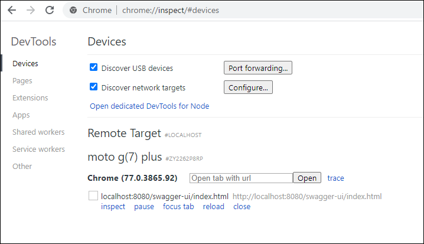

# Android の端末から PC のローカルサーバにアクセスする方法

Android 実機からローカルの API サーバに接続したい時がある。

## 実行環境
- Windows 10
- Android 端末
- USB ケーブル接続

## 手順

1. ローカルサーバを起動する（例: http://localhost:8080）
2. Android 端末を USB ケーブルでつなぐ
3. PC の Chrome を立ち上げ、以下のアドレスを開く
```
chrome://inspect/#devices
```



4. 「Port forwarding...」ボタンをクリックする

5. ポートと URL 欄に値を入力


6. 「Enable port forwarding」チェックボックスにチェックを入れ、「Done」ボタンを押下


7. Android 側から接続できることを確認する


